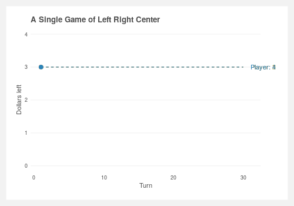

# Is it possible beat Left Right Center?
`left_right_center_dice_game.R`: R script that generates the simulations and plots the results

Around the holidays my family enjoys a game of [Left Right Center](https://en.wikipedia.org/wiki/LCR_(dice_game)), a chance-based dice game where everyone puts a few dollars on the line. It's a nice reprieve from the typical skill-based games much of family tends to play, and the only decision involved is what position within the family circle do you sit?

## Simulating it
If the game is totally up to chance then what is the point of simulating it? Is there actually an edge to be had? The expected average outcome of any given turn will result in less dollars for the player as only half the die faces (the dots) result in keeping dollars and the other half result in giving away dollars. Does this mean that its best to go last? Let's see.

