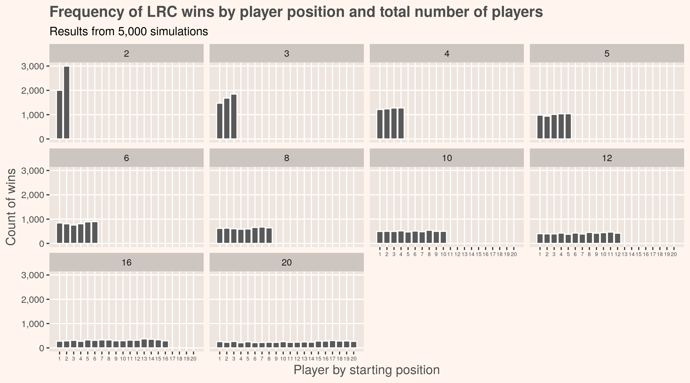
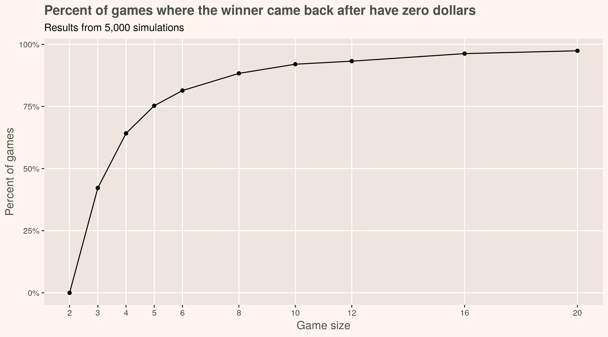

# Is it possible beat Left Right Center?
`left_right_center_dice_game.R`: R script that generates simulations of LRC and plots the results

Around the holidays my family enjoys a game of [Left Right Center](https://en.wikipedia.org/wiki/LCR_(dice_game)), a ~~completely~~ largely chance-based dice game where everyone puts a few dollars on the line. It's a nice reprieve from the typical skill-based games much of family tends to play, and the only decision involved is what position within the around the table do you sit? 

## Simulating it
If the game is totally up to chance then what is the point of simulating it? Is there actually an edge to be had? The expected average outcome of any given turn will result in less dollars for the player as only half the die faces (the dots) result in keeping dollars and the other half result in giving away dollars. Does this mean that its best to go last?

In order to simulate the game we need to first break it down into its core parts:
`rollDice()`: function calculates a single roll of the dice
`takeTurn()`: function calculates the result of `rollDice()` on the rolling player's score and the players adjacent to them
`playLRC()`: function pulls it all together and simulates a full game; returns the turn-by-turn game scores

We can now simulate many games with any number of players. Running this 50,000 times (10 different game sizes * 5,000 runs each) gives us simulated data of who typically wins the game.

There's clearly a gain for going last -- at least with the number of players is low. Once the group gets bigger than five it doesn't make a substantial difference, and this is confirmed by fiting a linear model and examining the betas.

You might not be able to get an edge during the larger games but at least you'll be in for something a little more exciting:

